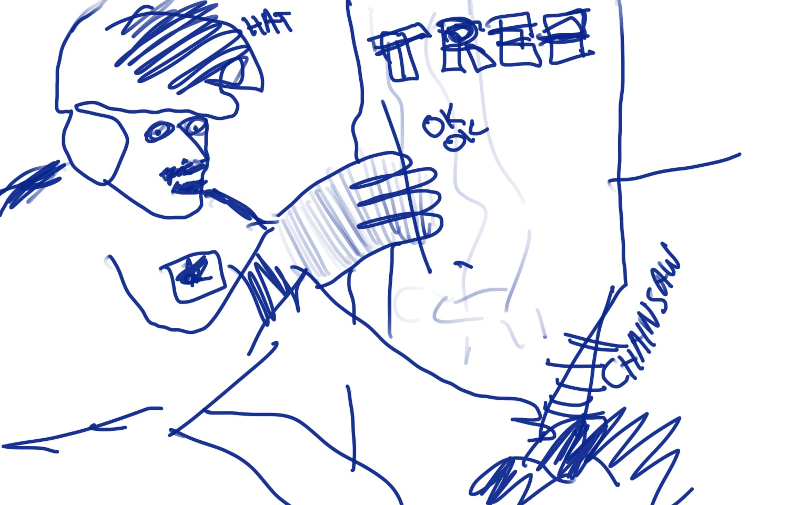

# @diso.io/bark



Unified observability for the diso stack: **logs, timing, and errors as
correlated structured records** over one shared request/user context. Zero
dependencies, isomorphic (browser · Cloudflare Workers · Node), tree-shakeable
ESM with types.

The point: when something goes wrong, you can drill from an error to everything
about that request and user. Every record carries a `traceId` (propagated
client → Worker via `traceparent`) plus whatever context you `set()` — so
"find this user's request" is a filter, not an archaeology dig.

**App code stays plain.** No wrapping call sites, no patched `fetch`. Instrument
once at the edges; capture passively; log deliberately.

> Formerly `@hello10/logger`.

```bash
npm install @diso.io/bark
```

## Worker

```ts
import Bark from '@diso.io/bark';

export default {
  async fetch(req: Request, env: Env, ctx: ExecutionContext) {
    const bark = Bark.start({ request: req }); // serializes request, adopts traceparent
    const user = await authenticate(req);
    bark.set({ userId: user.id });             // one call — rides on every record after

    const rows = await env.DB.prepare(sql).all();
    bark.info('loaded', { count: rows.length });

    return bark.finish({ response: Response.json(rows) });
    // ^ serializes response, adds Server-Timing, emits request summary, returns it
  }
};
```

Configure once (e.g. module top-level or first request):

```ts
Bark.configure({ level: 'info', format: 'json' }); // json-lines -> Workers Logs / Logpush
```

## Browser

```ts
import Bark from '@diso.io/bark';

const bark = Bark.start({ page: location.pathname });
// From here capture is passive: fetch/navigation timing (including any
// Server-Timing the server sent back) and uncaught errors/rejections.
// Plain fetch(), plain code everywhere else.

bark.info('booted');
```

## Scopes and branches

```ts
const cbark = bark.branch('checkout', { cart: cart.id }); // name-joined + fields
cbark.log('start checkout');        // log() == info(); name is "app:checkout"
cbark.error(err, { step: 'pay' });  // full error serialization + fingerprint
```

`branch()` shares the parent's context — a later `bark.set({ userId })` shows up
on branch records too. Names are `:`-joined and drive filtering.

## Everything is fields

One vocabulary everywhere: `start({ request })`, `set({ userId })`,
`info('msg', { count })`, `error(err, { action })`, `finish({ response })`.
Known keys are serialized by the **registry** (Cloudflare-aware defaults):

- `request` → method, url, path, select headers, `cf` colo/country/protocol
- `response` → status, select headers
- `error` → name, message, stack, own props, **`cause` chain**, and a stable
  **fingerprint** for grouping recurring errors

Add your own: `Bark.serializers.set('user', (u) => ({ id: u.id }))`.

## Filtering — the `LOGGER` grammar

Config resolution: `Bark.configure({ level })` → `process.env.LOGGER` →
`localStorage.LOGGER` → `'*'` (errors only). Grammar:

```
LOGGER="api*|info, ping:pong|trace, -timing:*, -noisy"
```

- `name|level` — names matching `name` (with `*` wildcards) log at `level`+
- bare level (`info`) — shorthand for `*|info`
- bare name — shorthand for `name|error`
- `-name` — exclude entirely (any level)

Levels: `trace debug info warn error fatal`.

## Timing

Passive by default: the browser already records fetch/navigation timing —
bark's observer just reads it, including the **`Server-Timing`** metrics your
Worker attached, closing the client → server → client loop. Opt-in spans on the
server feed that header:

```ts
const span = bark.span('db', 'primary query');
const rows = await env.DB.prepare(sql).all();
span.end();                       // -> Server-Timing: db;dur=12;desc="primary query"

const db = bark.instrument(env.KV, 'kv');  // or: proxy that times async calls
await db.get('key');                        // -> span "kv.get", call site untouched
```

- **Overhead:** collection is effectively free (observer reads native entries;
  spans are `Date.now()` + one header string). The real cost is record volume —
  turn collection off with `Bark.configure({ timing: false })`, or keep it but
  silence the records with `-timing:*`.
- **Workers caveat:** in production, Workers freeze the clock between I/O
  (Spectre mitigation), so spans measure **I/O-bracketed** work (fetch/KV/D1/R2),
  not CPU. In `wrangler dev` time advances normally.
- **Cross-origin:** browsers only expose `Server-Timing` to JS same-origin
  unless you set `Bark.configure({ timingAllowOrigin: '...' })`.

## Records

Every record is `{ kind: 'log'|'timing'|'error', level, name, message?, time,
traceId, fields }`. Formats: `pretty` (default, devtools/wrangler-friendly) or
`json` (one line per record), or a custom `Formatter`. Route them anywhere with
a custom sink:

```ts
Bark.configure({
  format: 'json',
  sink: (record, formatted) => queue.push(record) // or console, or Analytics Engine
});
```

## API

- `Bark.start(fields?, name = 'app')` → scope · `Bark.configure(config)` ·
  `Bark.serializers` · `Bark.levels`
- scope: `.trace/.debug/.info/.log/.warn/.error/.fatal(messageOrError?, fields?)`
  · `.set(fields)` · `.branch(name, fields?)` · `.span(name, desc?)` →
  `{ end(fields?) }` · `.instrument(obj, label?)` · `.finish(fields?)` →
  `Response | undefined` · `.traceId` · `.traceparent`

Full reference: `pnpm --filter @diso.io/bark docs` (TypeDoc).

## Migrating from @hello10/logger

- `new Logger({name: 'foo', ...})` → `new Bark('foo')` + `.set({...})`, or just
  `Bark.start({...})` / `branch()`.
- `logger.child({name})` → `bark.branch(name, fields?)`.
- `Logger.config = '...'` → `Bark.configure({ level: '...' })` (same grammar,
  plus bare-level shorthand).
- Level methods take `(message?, fields?)` or `(error, fields?)` — no more
  unbounded varargs.
- Output goes through formatters/sinks instead of raw `console[level](message,
  body)`; `pretty` is close to the old shape.

See the [monorepo README](../../README.md) for the workspace and release flow.
